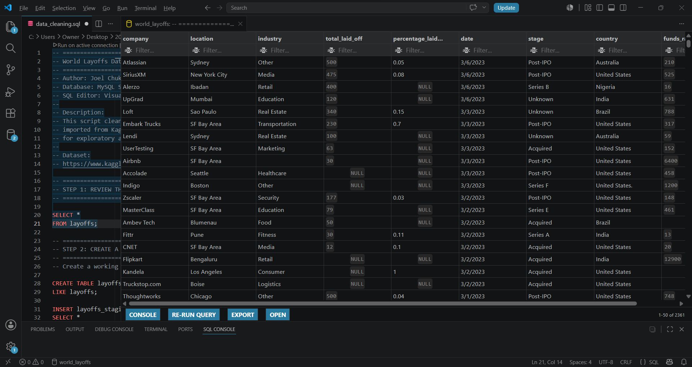
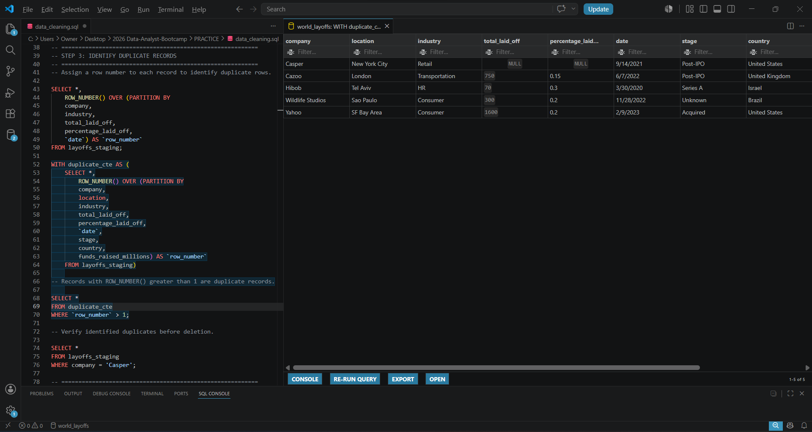
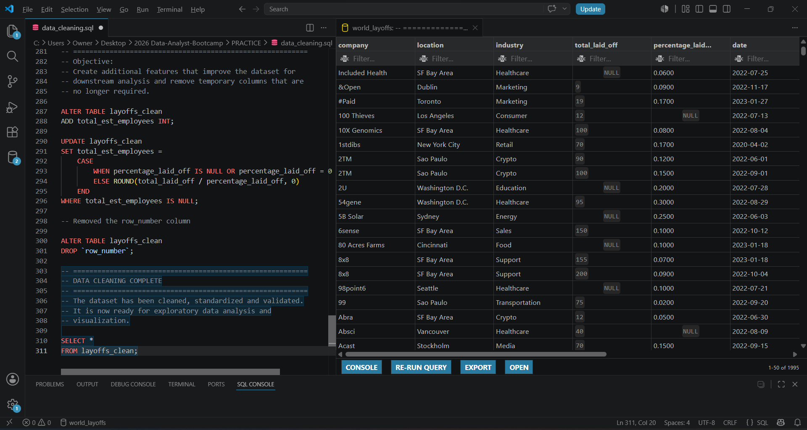

#  World Layoffs Data Cleaning

## Project Overview

This project demonstrates SQL data cleaning workflow using the **World Layoffs** dataset from Kaggle.

The objective was to transform raw company layoff data into a clean, standardized dataset suitable for analysis and visualization.

---

## Dataset

**Source:** Kaggle – World Layoffs Dataset

The dataset contains information such as:

- Company
- Industry
- Location
- Country
- Total Employees Laid Off
- Percentage Laid Off
- Date
- Company Stage
- Funds Raised

**Raw Dataset**

---

## Business Problem

Raw datasets often contain issues that make analysis unreliable, including:

- Duplicate records
- Missing values
- Inconsistent text formatting
- Incorrect data types
- Inconsistent category names

The goal of this project is to identify and correct these issues, resulting in a clean dataset ready for analysis.

---

## Project Objectives

- Preserve the original dataset
- Remove duplicate records
- Standardize text values
- Correct data types
- Handle missing values
- Create additional useful features
- Validate the cleaned dataset

---

## Data Import Process

The original dataset was imported into MySQL Server using the **Table Data Import Wizard**.

The workflow was:

1. Create a new schema named `world_layoffs`.
2. Import the CSV using the MySQL Table Data Import Wizard.
3. Open the database in Visual Studio Code.
4. Perform all data cleaning operations using SQL.

---

## SQL Skills Demonstrated

- Window Functions
- Common Table Expressions (CTEs)
- Data Cleaning
- Data Standardization
- Data Validation
- Feature Engineering
- Data Type Conversion
- NULL Handling

---

## Files

| File                     | Description                                                                           |
| ------------------------ | ------------------------------------------------------------------------------------- |
| `sql/data_cleaning.sql`  | SQL script containing the complete data cleaning workflow                             |
| `data/layoffs_raw.csv`   | Original dataset downloaded from Kaggle                                               |
| `data/layoffs_clean.csv` | Cleaned dataset generated after the data cleaning process                             |

---

## Dataset Cleaning Summary

✔ Removed duplicate records

✔ Standardized inconsistent company, industry, country and location values

✔ Converted the Date column to DATE datatype

✔ Handled missing values where possible

✔ Removed rows containing insufficient information

✔ Created an estimated employee count column

**Duplicate Detection Query**

---

## Tools Used

| Tool | Purpose |
|------|---------|
| Visual Studio Code | SQL development |
| MySQL Server | Database management |
| SQL | Data cleaning and transformation |
| Kaggle | Dataset source |
| Git & GitHub | Project documentation and hosting |

---

## Results

The cleaning process produced a standardized dataset that is ready for exploratory data analysis and visualization.

Key improvements include:

- Duplicate records removed
- Missing values handled where possible
- Consistent categorical values
- Correct data types
- New analytical feature added
- Dataset validated for downstream analysis

**Cleaned Dataset**

---

## Future Improvements

- Perform Exploratory Data Analysis (EDA)
- Develop an interactive Power BI dashboard
- Automate parts of the data cleaning workflow

---

## Project Environment

- Database: MySQL Server 8.0
- SQL Editor: Visual Studio Code
- Operating System: Windows 11

---

## Author

**Joel Chukwudi Okolie**

Aspiring Data Analyst

GitHub: https://github.com/joelokolie

LinkedIn: https://www.linkedin.com/in/joel-okolie

---

## Next Project

The cleaned dataset produced in this project was used for further analysis in:

- **[Business Insights from the World Layoffs Dataset](https://github.com/joelokolie/world-layoffs-analysis)**

